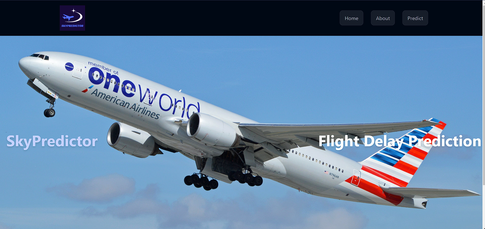
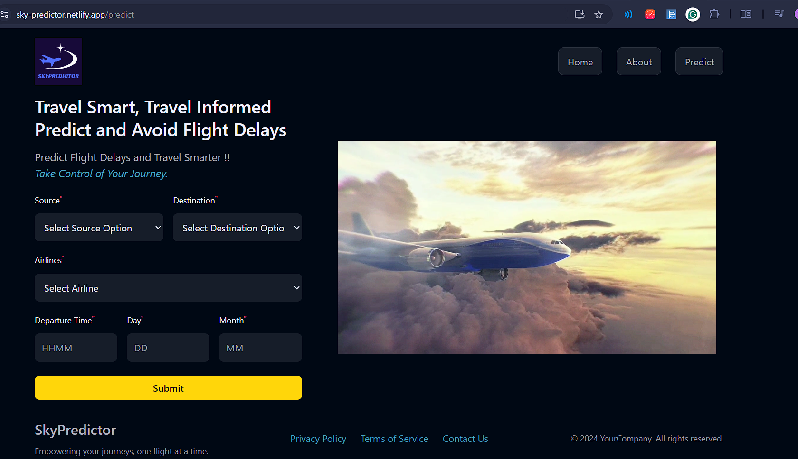

# SkySync 
Deployed website can be found on [Link](https://sky-predictor.netlify.app).

## Project Overview

**SkySync** is a sophisticated machine learning project designed to forecast flight delays with high accuracy using an XGBoost classifier. This fully deployed system leverages advanced predictive analytics to enhance airline operations and passenger experience by providing timely and accurate delay predictions.

## Key Features

- **High Accuracy**: Achieved 85% accuracy in predicting flight delays.
- **Advanced Modeling**: Utilized XGBoost, an effective and scalable gradient boosting framework, for superior prediction performance.
- **Comprehensive Implementation**: Developed with Python, incorporating libraries such as XGBoost, scikit-learn, and Matplotlib for model training, evaluation, and visualization.
- **Fully Deployed**: The system is fully deployed, integrated with real-time flight data sources, and accessible through a user-friendly interface.

## Website Images 

<em>Figure 1: Landing page of the Flight Delay Predictor</em>

<em>Figure 2: Predict page of the Flight Delay Predictor</em>

<em>Figure 3: Dashboard of the Flight Delay Predictor</em>

## Future Scope

- **Enhanced Predictive Models**: Explore additional machine learning algorithms and ensemble methods to further improve prediction accuracy.
- **Real-Time Data Integration**: Expand the system to incorporate real-time flight data from multiple sources for dynamic predictions.
- **User Interface Improvements**: Enhance the user interface with interactive dashboards and detailed analytics.
- **Global Expansion**: Adapt the model for use in different geographical regions and airlines to broaden its applicability.

## Societal Impact

The Flight Delay Predictor contributes to:

- **Improved Passenger Experience**: By providing accurate delay forecasts, passengers can plan their travel more effectively and reduce inconvenience.
- **Operational Efficiency**: Airlines can optimize scheduling and resource allocation, leading to cost savings and better service delivery.
- **Sustainable Practices**: Helps in reducing unnecessary fuel consumption and emissions associated with delayed flights.
